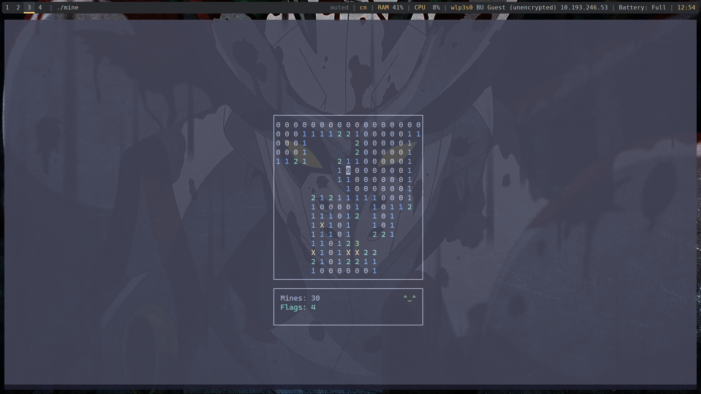

# Minesweeper in C

This is a command-line Minesweeper game written in C using `ncurses`. This project served as my first venture into C programming, where I learned about memory management, terminal-based UI development, and cross-platform compilation.

## Features

- **Classic Minesweeper gameplay** with random mine placement
- **Ncurses-based UI** for smooth terminal interaction
- **Flood reveal** for uncovering multiple empty cells
- **Flagging system** to mark potential mines
- **Win/Loss detection**
- **Customizable board size and mine count**
- **OS-specific compilation**: The Makefile detects Linux, macOS, or Windows (MinGW) and adjusts flags and libraries accordingly.

## Screenshots



## Installation

### Prerequisites

Ensure you have `ncurses` installed on your system:

#### Linux (Debian-based distros)
```sh
sudo apt install libncurses5-dev libncursesw5-dev
```

### MacOS (using Homebrew)

```sh
brew install ncurses
```

### Compilation

To compile using `make`, run:

```sh
make
```

This will generate an executable named `mine`.

To remove the compiled binary, use:

```sh
make clean
```


### Global Installation
For convenience, an `install.sh` script is provided. This script:

* Compiles the project using the Makefile
* Copies the executable from bin/mine to ~/.local/bin
* Ensures that ~/.local/bin is in your PATH

To install the game globally, run the following command from the project root:

```sh
./install.sh
```
After installation, you can start the game from anywhere by simply typing:

```sh
mine
```
If `~/.local/bin` isn’t already in your PATH, the script will add it to your shell configuration files (`~/.bashrc` and/or `~/.zshrc`).


### Running the Game

```sh
make run
```

or 

if you have installed the game globally:
```sh
mine
```

or

```sh
./bin/mine
```

## How to Play

- Use **arrow keys** to move the cursor
- Press **Enter** to reveal a tile
- Press **F** to place/remove a flag
- The goal is to reveal all non-mine tiles without detonating a mine

## Future Improvements

- Add difficulty selection at startup
- Implement a timer and score tracking
- Improve UI with color themes

## License

This project is open-source under the MIT License.

